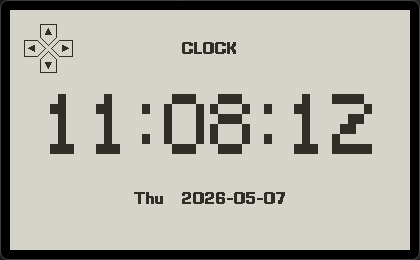
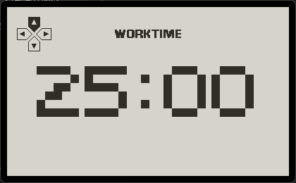
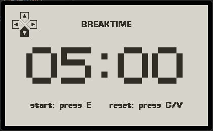
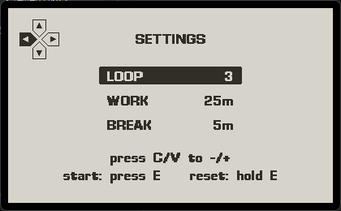
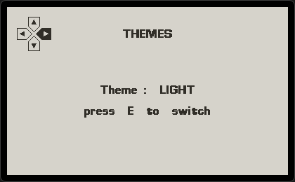
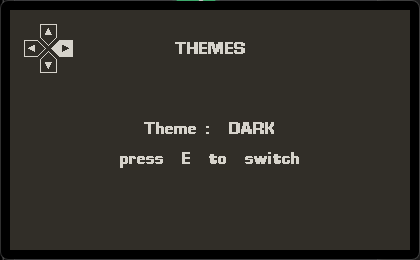
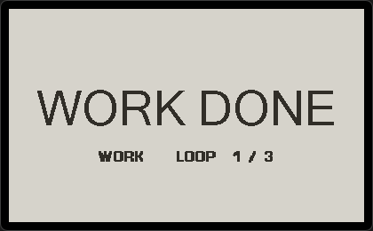

# Pomodoro for Playdate

番茄钟，由`pomodoro for playdate`移植而来。

## 功能介绍

- **时钟首页**：默认显示当前时间和日期。

  

- **工作计时**：提供默认 25 分钟的专注计时。

  

- **休息计时**：提供默认 5 分钟的休息计时。

  

- **循环番茄钟**：可按「工作 - 休息」的节奏自动循环，默认循环 3 次。

- **自定义设置**：可以调整循环次数、工作时长和休息时长。

  

- **主题切换**：支持深色和浅色两种显示主题。

  

  

- **完成提醒**：计时结束后会显示阶段完成提示，并播放提示音。

  

## 操作概览

- 方向键切换页面：工作计时、休息计时、设置、主题。
- `E` 键开始计时或切换主题。
- 设置页长按 `E` 键可恢复默认设置。
- `C` `V`用于调整设置或重置计时。
- 选中时使用`ESC`退出。
